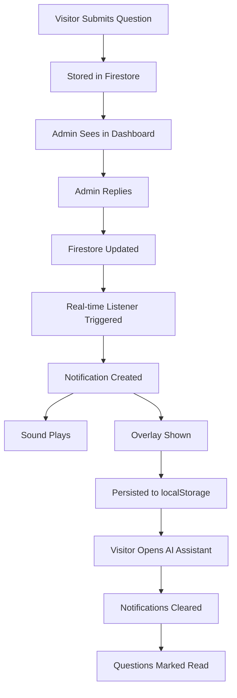

# Direct Questions Notification System Implementation Plan

## Issues Identified

1. **Admin Authentication Mismatch**
   - Admin panel uses JWT token auth (`admin_token` cookie)
   - API routes expect `admin_session=verified` cookie
   - Status updates fail due to authentication inconsistency

2. **Missing Notification System**
   - No notifications when admin replies to visitor questions
   - No persistent overlay system until visitor reads answer
   - No sound/visual effects for notifications

3. **Read/Unread CRUD Issues**
   - Inconsistent read/unread state management
   - Need proper notification persistence tracking

## Implementation Strategy

### Phase 1: Fix Admin Authentication System

#### 1.1 Update API Route Authentication
- **File**: `app/api/admin/direct-questions/[id]/route.ts`
- **Change**: Replace custom auth with proper JWT verification
- **Implementation**:
  ```typescript
  import { verifyAdminToken } from '@/utils/adminAuth';
  
  async function verifyAdminAuth(request: NextRequest): Promise<boolean> {
    const admin = await verifyAdminToken(request);
    return admin !== null;
  }
  ```

#### 1.2 Fix Admin Panel API Calls
- **File**: `app/admin/direct-questions/[id]/page.tsx`
- **Issue**: API calls use `Authorization: Bearer admin` instead of cookies
- **Fix**: Remove authorization headers, rely on cookies

### Phase 2: Implement Notification System

#### 2.1 Create Notification Components

**A. Persistent Notification Overlay**
- **File**: `components/direct-questions/NotificationOverlay.tsx`
- **Features**:
  - Shows when visitor has unread admin replies
  - Persists across page reloads until dismissed
  - Shows answer preview
  - Sound notification option
  - Animates in/out with smooth transitions

**B. Notification Bell/Indicator**
- **File**: `components/direct-questions/NotificationBell.tsx`
- **Features**:
  - Shows unread count badge
  - Pulses when new notifications arrive
  - Integrates with AI assistant button

#### 2.2 Notification State Management

**A. Notification Store**
- **File**: `lib/notificationStore.ts`
- **Features**:
  - Tracks notification state per visitor
  - Persists to localStorage
  - Manages read/unread states
  - Handles notification preferences

**B. Real-time Notification Listener**
- **File**: `lib/notificationListener.ts`
- **Features**:
  - Listens for new admin replies in real-time
  - Triggers notification displays
  - Handles sound notifications
  - Manages notification persistence

#### 2.3 Integration with AI Assistant

**A. Update EnterpriseAIAssistant**
- **File**: `components/ai-assistant/enhanced/EnterpriseAIAssistant.tsx`
- **Changes**:
  - Add notification indicator to floating button
  - Show notification count in assistant
  - Clear notifications when ask-directly tab opened
  - Mark questions as read when viewed

### Phase 3: Enhanced Notification Features

#### 3.1 Notification Types
- **New Answer**: "Gaurav has answered your question"
- **Multiple Answers**: "You have 3 new answers from Gaurav"
- **Answer Updated**: "Gaurav updated their answer"

#### 3.2 Notification Persistence Logic
```typescript
interface NotificationState {
  visitorUuid: string;
  unreadNotifications: {
    questionId: string;
    type: 'new_answer' | 'updated_answer';
    timestamp: Date;
    questionPreview: string;
    answerPreview: string;
    isRead: boolean;
    isShown: boolean;
  }[];
  lastShownTime: Date;
  preferences: {
    soundEnabled: boolean;
    persistentOverlay: boolean;
    showPreviews: boolean;
  };
}
```

#### 3.3 Sound Notification System
- **File**: `components/direct-questions/NotificationSound.tsx`
- **Features**:
  - Play notification sound when new answer arrives
  - Respectful volume and timing
  - User can enable/disable in settings
  - Different sounds for different notification types

### Phase 4: API Enhancements

#### 4.1 Notification Management API
- **File**: `app/api/notifications/route.ts`
- **Endpoints**:
  - `GET /api/notifications` - Get visitor notifications
  - `POST /api/notifications/mark-read` - Mark notifications as read
  - `POST /api/notifications/preferences` - Update notification preferences

#### 4.2 Enhanced Direct Questions API
- **File**: `app/api/direct-questions/route.ts`
- **Enhancements**:
  - Include notification metadata in responses
  - Track when notifications are shown/read
  - Support notification preferences

### Phase 5: UI/UX Implementation

#### 5.1 Notification Overlay Design
```css
.notification-overlay {
  position: fixed;
  top: 20px;
  right: 20px;
  max-width: 400px;
  background: linear-gradient(135deg, #667eea 0%, #764ba2 100%);
  border-radius: 12px;
  padding: 16px;
  color: white;
  box-shadow: 0 20px 25px -5px rgba(0, 0, 0, 0.1);
  animation: slideIn 0.3s ease-out;
  z-index: 9999;
}
```

#### 5.2 Integration Points
- Main portfolio page (`app/page.tsx`)
- AI Assistant component
- Direct questions list component
- Admin panel for testing

### Phase 6: Testing Strategy

#### 6.1 Admin Flow Testing
1. Admin logs into panel
2. Admin replies to visitor question
3. Status updates correctly to "answered"
4. `unreadForVisitor` flag set to `true`

#### 6.2 Visitor Notification Testing
1. Visitor submits question
2. Admin replies
3. Visitor sees notification immediately (if online)
4. Notification persists across page reloads
5. Notification clears when visitor opens AI assistant
6. Question marked as read when viewed

#### 6.3 Edge Cases Testing
- Multiple notifications
- Network disconnection/reconnection  
- Browser refresh during notification display
- Multiple tabs open
- Notification preferences
- Sound notification with/without user interaction

## Implementation Files to Create/Modify

### New Files to Create
1. `components/direct-questions/NotificationOverlay.tsx`
2. `components/direct-questions/NotificationBell.tsx`
3. `components/direct-questions/NotificationSound.tsx`
4. `lib/notificationStore.ts`
5. `lib/notificationListener.ts`
6. `app/api/notifications/route.ts`
7. `hooks/useNotifications.ts`
8. `types/notifications.ts`

### Existing Files to Modify
1. `app/api/admin/direct-questions/[id]/route.ts` - Fix auth
2. `app/admin/direct-questions/[id]/page.tsx` - Fix API calls
3. `components/ai-assistant/enhanced/EnterpriseAIAssistant.tsx` - Add notifications
4. `app/page.tsx` - Add notification overlay
5. `lib/types.ts` - Add notification types
6. `lib/askDirectly.ts` - Enhanced notification support

## Success Criteria

1. ✅ Admin can successfully update question status and send replies
2. ✅ Visitor receives immediate notification when admin replies
3. ✅ Notification persists until visitor opens AI assistant and reads answer
4. ✅ Sound notification plays (if enabled) when new answer arrives
5. ✅ Notification shows answer preview and question context
6. ✅ Read/unread states work correctly across page reloads
7. ✅ Multiple notifications are handled gracefully
8. ✅ Notification preferences are saved and respected
9. ✅ Real-time updates work even when visitor is on different pages
10. ✅ System works bug-free across different browsers and devices

## Technical Architecture



This comprehensive plan addresses all the issues identified and provides a complete solution for the direct questions notification system.